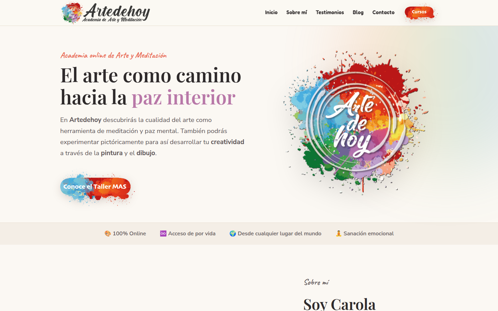
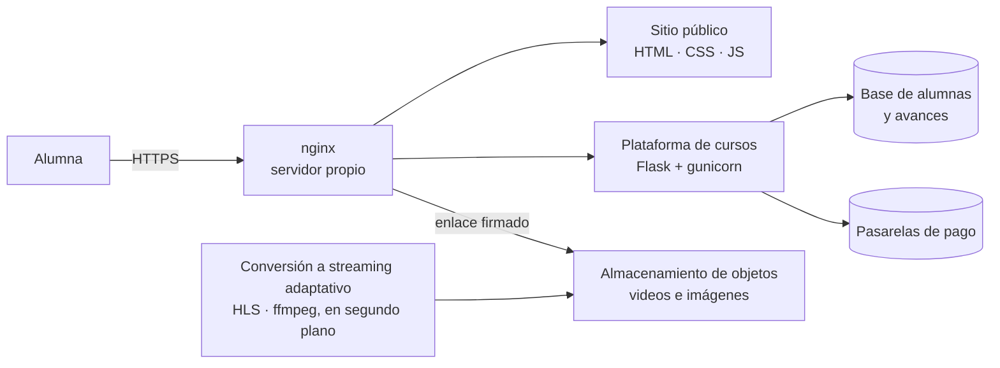
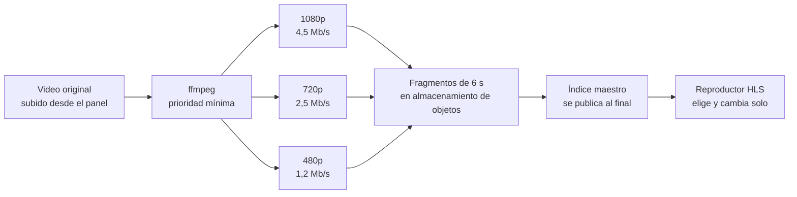
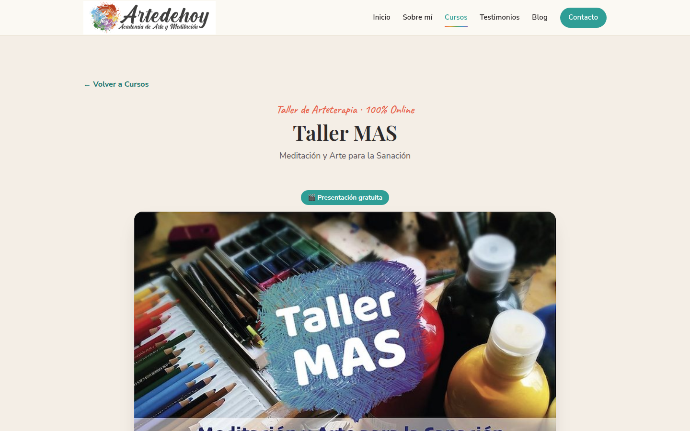
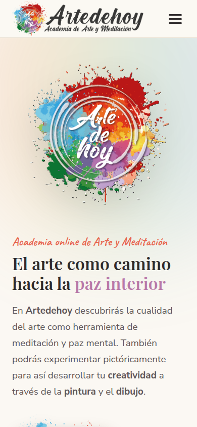

# Artedehoy — sitio y plataforma de cursos

Sitio web y plataforma de cursos en video para una academia de arte y meditación.
Proyecto personal, en producción y con alumnas reales. Diseñado y construido de
punta a punta: front, backend, video, pagos e infraestructura.

**En vivo:** [artedehoyacademia.com](https://artedehoyacademia.com)

---

## Cómo está armado

**El sitio público** es estático: HTML, CSS y JavaScript escritos a mano. Sin
framework, sin dependencias, sin nada que actualizar.

**La plataforma** es una aplicación Flask con cuentas de alumnas, inscripción a
cursos, seguimiento del avance, certificados y un panel de administración.

**El video** no se sirve desde el servidor. Vive en almacenamiento de objetos y
se entrega mediante enlaces firmados que caducan, de modo que un video no se
puede compartir por fuera de la plataforma.

---

## Detalles que valen

### Streaming adaptativo (HLS): el video se ve bien aunque la conexión sea mala

Es el problema central de una academia en video: la alumna que mira desde el
celular, con datos del teléfono o un wifi flojo, no puede quedarse esperando a
que cargue. Y la que tiene buena conexión no tiene por qué verlo en baja calidad.

La solución se llama **streaming adaptativo**: no tener **un** video sino
**tres versiones del mismo video**, y dejar que el reproductor elija cuál usar en
cada momento. Es la misma técnica con la que YouTube y Netflix entregan su
contenido. La variante que usa esta plataforma es **HLS** (HTTP Live Streaming),
el estándar abierto que funciona en cualquier navegador y celular.

**Cómo funciona.** Cuando se sube un video, un proceso lo convierte a tres
calidades (1080p, 720p y 480p) y corta cada una en pedazos de seis segundos. El
reproductor de la alumna mide cuánto tarda en llegar cada pedazo. Si la conexión es buena, pide los de 1080p. Si se pone lenta, pasa a
720p o 480p sin cortar la reproducción, y vuelve a subir cuando mejora. En un
teléfono con señal pobre el video arranca igual, en calidad baja, en vez de
quedarse cargando.

**Tres decisiones de diseño** que están en el guion
[`codigo/cocina-hls.sh`](codigo/cocina-hls.sh):

1. **La conversión corre con la prioridad más baja que permite el sistema.**
   Convertir video consume mucho procesador, y el servidor es chico. La web
   siempre va primero; la conversión usa lo que sobra.
2. **El original nunca se toca.** Las tres versiones se guardan al lado, en su
   propia carpeta. Si algo sale mal, el original está intacto.
3. **El índice maestro se publica último.** Es el archivo que le dice al
   reproductor qué calidades existen. Mientras no está, el aula usa el video
   original tal cual se subió. Así nunca se sirve un video a medio convertir:
   o está completo, o se usa el original.

En la casa se le dice "cocina" a ese proceso, porque recibe el video crudo y lo
deja listo para servir. De ahí el nombre del archivo.

### El logo se dibuja solo

La portada no muestra una imagen del logo: lo forma delante de quien mira. Las
salpicaduras de pintura caen una por una, después se escribe la caligrafía y se
trazan los aros.

Para lograrlo hubo que descomponer el logo original en once piezas exactas
mediante análisis de píxeles, y verificar que apiladas reconstruyeran el archivo
original con un error máximo de menos de un punto sobre doscientos cincuenta y
cinco, es decir, invisible. La animación corre sobre canvas y respeta la
preferencia del sistema de reducir movimiento: quien la tenga activada ve el
logo quieto.

El código está en [`codigo/logo-anim.js`](codigo/logo-anim.js) y las herramientas
que fabricaron las piezas, en [`codigo/`](codigo/).

### El precio se muestra en la moneda de quien mira

Los precios están fijados en dólares, pero nadie ve dólares: la plataforma
detecta el país del visitante y le muestra un solo precio, en su moneda, con
la cotización actualizada sola. Al pagar, quien está en Argentina o Chile usa
Mercado Pago con su medio local; quien está en cualquier otro país, PayPal.
Ninguna tarjeta pasa por la web: el pago se aprueba en la pasarela y la
plataforma solo recibe la confirmación.

### Todo lo que pasa se avisa solo

Nueve situaciones distintas disparan un correo automático, a la alumna o a la
dueña de la academia: cuenta creada, pago confirmado o rechazado, inscripción
por transferencia iniciada, certificado emitido, reembolso pedido y reembolso
procesado, mensaje de contacto recibido, y acceso de regalo enviado con una
clave provisoria. La alumna también recupera su contraseña sola, con un enlace
que caduca, sin que nadie tenga que intervenir.

### Cuidados que no se ven

- Los intentos de ingreso están limitados por dirección: quien insiste con
  contraseñas queda frenado por el servidor antes de llegar a la aplicación.
- La base de alumnas se copia todos los días, sola, a otra máquina.
- Los videos nunca se sirven por una dirección fija: cada enlace se firma y
  caduca, así que compartirlo no sirve de nada al rato.
- Una alumna puede pedir un reembolso desde su propia cuenta, y el pedido le
  llega a la dueña con todos los datos para resolverlo.

### Un panel para alguien que no es técnico

El panel de administración se diseñó con una sola regla: que se entienda sin
manual. Subir un video, crear un curso, ver quién se inscribió y aprobar un pago
son cuatro botones, no cuatro pantallas de configuración.

### Certificados

Al terminar un curso, la plataforma genera el certificado con el nombre de la
alumna sobre el diseño original de la academia, con la letra manuscrita y la
firma en su lugar.

---

## En el celular

---

**Verlo funcionando:** [artedehoyacademia.com](https://artedehoyacademia.com). Se puede recorrer el sitio, ver un curso y la presentación gratuita sin registrarse.

---

## Con qué está hecho

| Capa | Herramienta |
|---|---|
| Sitio | HTML, CSS y JavaScript sin framework |
| Plataforma | Python con Flask y SQLAlchemy, servida por gunicorn |
| Servidor web | nginx con HTTPS y certificado renovado solo |
| Datos | SQLite |
| Video | Streaming adaptativo HLS: ffmpeg lo convierte a tres calidades |
| Medios | Almacenamiento de objetos compatible con S3 |
| Pagos | Mercado Pago (Argentina y Chile) y PayPal (resto del mundo) |
| Servidor | Una máquina virtual chica en Santiago de Chile |

El servidor cuesta menos de doce dólares por mes y aloja varios sitios a la vez.
El costo no crece con la cantidad de alumnas.

---

## Qué se muestra acá y qué no

Este repositorio es una vitrina, no el producto. Contiene la explicación de cómo
está armado el proyecto, capturas de la web funcionando y una selección del
código propio:

| Archivo | Qué es |
|---|---|
| [`codigo/logo-anim.js`](codigo/logo-anim.js) | La animación de formación del logo, tal como corre en la portada |
| [`codigo/descomponer-logo.py`](codigo/descomponer-logo.py) | Descompone el logo en piezas exactas analizando los píxeles |
| [`codigo/generar-animacion.py`](codigo/generar-animacion.py) | Arma la animación a partir de esas piezas |
| [`codigo/cocina-hls.sh`](codigo/cocina-hls.sh) | Convierte cada video a tres calidades en fragmentos (HLS), para que el reproductor se adapte a la conexión |
| [`codigo/style.css`](codigo/style.css) | La hoja de estilos del sitio, escrita a mano |

No incluye la plataforma de cursos, los pagos, el panel de administración ni nada
que toque datos de alumnas.

Tampoco incluye las imágenes del sitio, y es a propósito. Las páginas legales
llevan datos personales de identificación y domicilio. Las fotografías de
testimonios son caras de alumnas reales, que dieron su permiso para aparecer en
la web y no para quedar en un repositorio que cualquiera puede copiar. Y algunas
imágenes ilustrativas provienen de bancos de imágenes, cuya licencia permite
usarlas en un sitio pero no redistribuir el archivo.

Todo eso se ve en la web en vivo, que es donde corresponde.

---

## Derechos

El código de este repositorio está bajo [licencia MIT](LICENSE). Esa licencia cubre únicamente el código.

Las capturas de pantalla, el logotipo y la obra artística **no** lo están:
son de Carola Arriagada y conservan todos los derechos reservados. Se publican
con su autorización, solo para ilustrar este trabajo. Ver [DERECHOS.md](DERECHOS.md).

Código © 2026 DruidaTech (Edgardo Rodríguez) · Obra artística © Carola Arriagada

Construido por **Edgardo Rodríguez** · [DruidaTech](https://druidatech.net)
